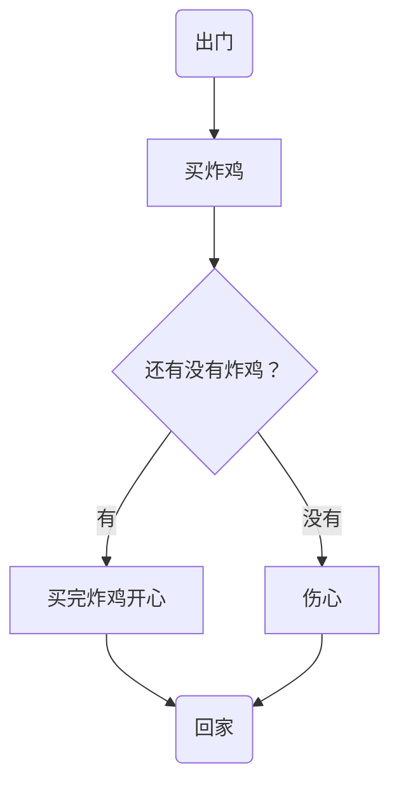

[学习教程](https://www.bilibili.com/video/BV1C7411V7SF?from=search&seid=10671318040615643124&spm_id_from=333.337.0.0)

[参考博客](https://blog.csdn.net/weixin_41452976/article/details/104299766)

官方帮助文档：https://mermaid-js.github.io/mermaid/#/flowchart


## 总结

语言要设置为 mermaid


| 表述       | 说明          | 含义                     |
| ---------- | ------------- | ------------------------ |
| id[文字]   | 矩形节点      | 表示过程，流程中一个环节 |
| id(文字)   | 圆角矩形节点  | 表示开始和结束           |
| id((文字)) | 原型节点      | 表示连接                 |
| id{文字}   | 菱形节点      | 表示判断 决策            |
| id>文字]   | 旗帜状节点    |                          |
| TB         | TOP to bottom | 从上到下                 |


```
graph TB
    begin(出门)--> buy[买炸鸡]
    buy --> IsRemaining{"还有没有炸鸡？"}
    IsRemaining -->|有|happy[买完炸鸡开心]--> goBack(回家)
    IsRemaining --没有--> sad["伤心"]--> goBack
    
```





## 序列图画法

语言设置为： sequence

```
Title: 买炸鸡
救救->>炸鸡店小哥: 还有炸鸡吗？
炸鸡店小哥-->>救救: 没有，要现炸

```


```sequence
Title: 买炸鸡
救救->>炸鸡店小哥: 还有炸鸡吗？
炸鸡店小哥-->>救救: 没有，要现炸


	
```


| 类型 | 描述                         |
| ---- | ---------------------------- |
| ->   | 无箭头的实线                 |
| –>   | 无箭头的虚线                 |
| ->>  | 有箭头的实线（主动发出消息） |
| –->> | 有箭头的虚线（响应）         |
| -x   | 末端为叉的实线（表示异步）   |
| –x   | 末端为叉的虚线（表示异步）   |

