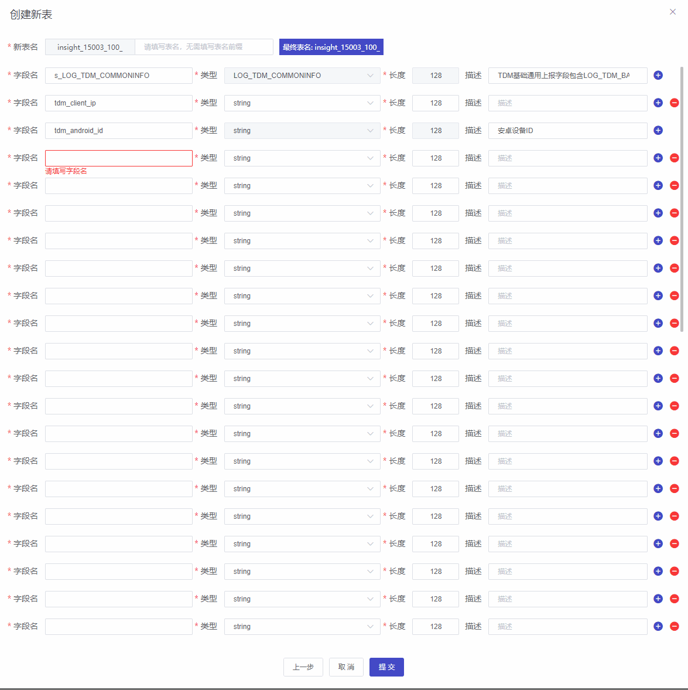
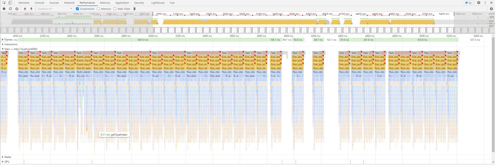
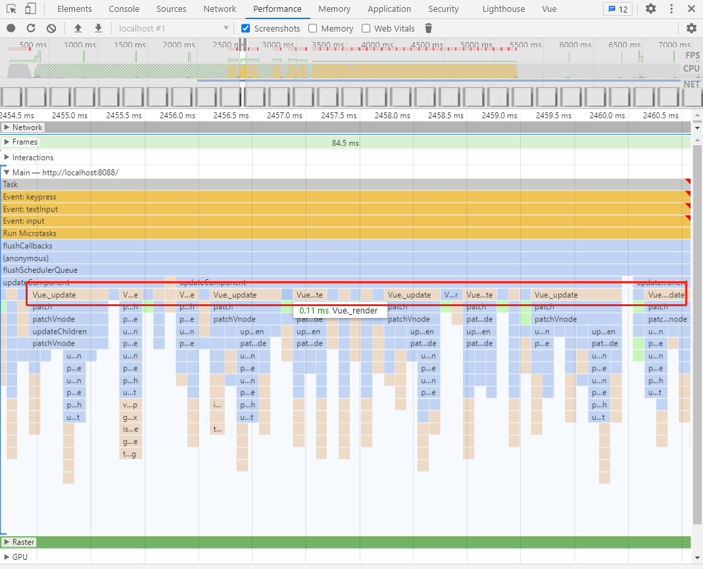
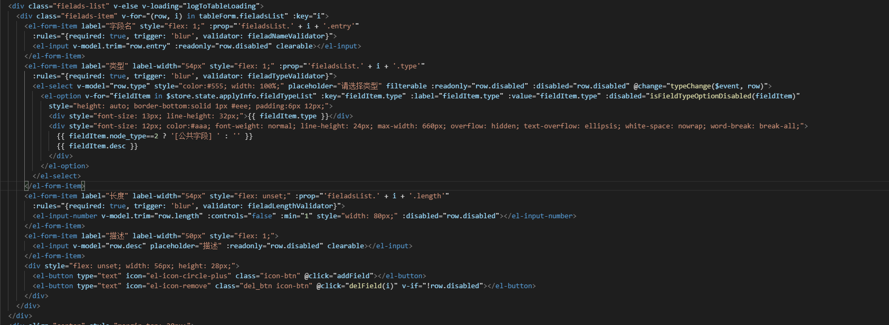
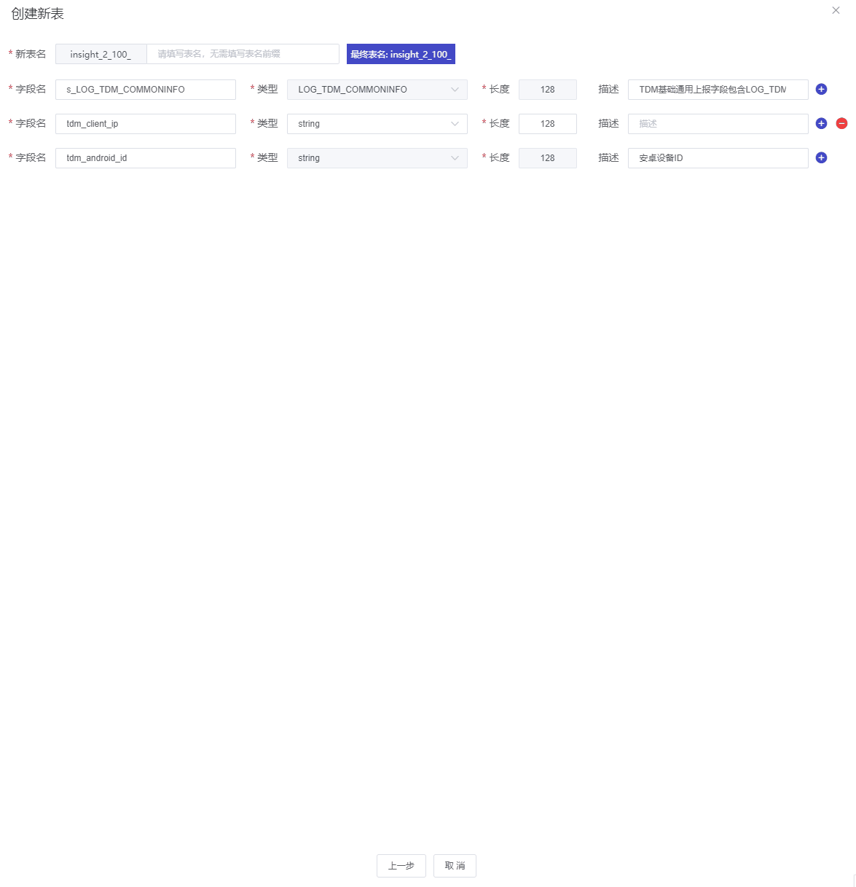
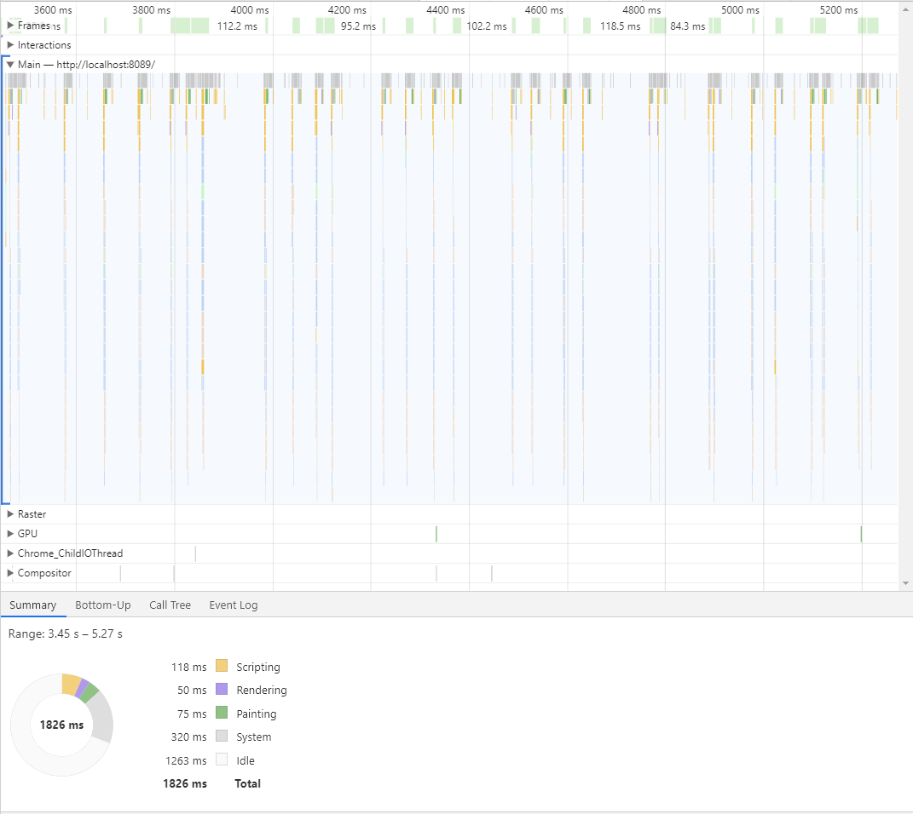

# TDM表单输入延迟优化

### 问题描述

在TDM控制台埋点管理新增数据表中，可以新建大量字段名，当字段条数较少时（少于20个左右），输入延迟感并不强烈，但一次性创建条数较多时，会出现明显延迟感

（持续输入过程）

### 抓包分析

（抓包分析）

抓包分析后发现在输入的过程中不断的在触发Vue_render和Vue_update

### 优化

在原代码中，根据条目数通过`v-for`循环生成四个`el-form-item`表单列表项，因为直接挂载在组件根部，所以每次添加都需要从组件根部开始深度遍历，从而导致输入延迟

#### 解决

那么解决方案就是最小化组件，最好不要在一个vue组件上直接绑定过多的数据，如果有大量数据请分多个组件绑定，减小当前组件绑定的数据量，将上述代码提取成组件

#### 优化结果

优化后输入延迟感明显降低

### 总结

vue提倡最小化组件，当组件数据量过大时要考虑拆分组件，减小组件数据过大而导致深度递归时间过长，造成感官上延迟